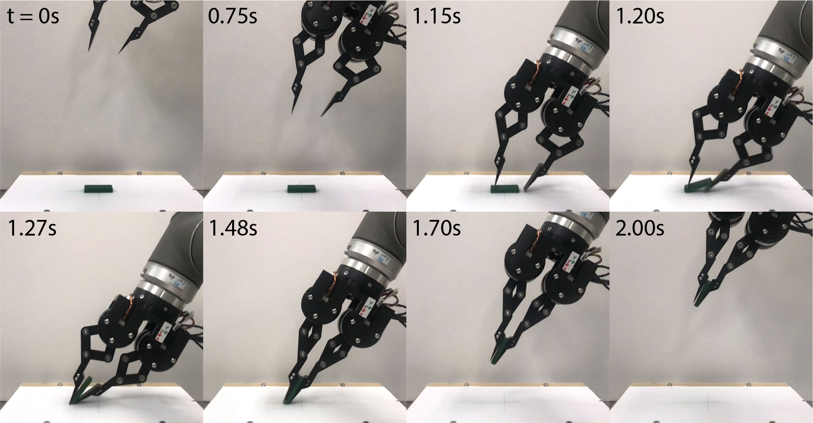

# High-Speed Scooping

## 1. Overview
This repository contains the software implementation of **High-Speed Scooping** using a [direct-drive gripper](https://github.com/HKUST-RML/ddh_hardware). It can be applied to rapidly picking thin objects off from a hard surface, which would be quite challenging with a straightforward approach aiming at directly obtaining a pinch grasp. See below for a comparison of our high-speed scooping with the traditional approach.
<!-- This repository contains the implementation of **High-Speed Scooping**, which refers to the task of picking up thin objects rapidly by interacting with the environment through a direct-drive gripper. Our scooping technique ensures a pinch grasp configuration can be obtained to pick up the object securely, which addresses the limitation of [**Smack and Snatch**](https://www.youtube.com/watch?v=xnHtb0XP3U4&ab_channel=ManipulationLab) that is unstable for grasping relatively thin objects, for example, plastic cards. -->

### *High-Speed Scooping (Ours)*
<p align = "center">
 
 
</p>

### *Direct Pinch Grasping (Traditional)*
<p align = "center">
 
 
</p>

## 2. Prerequisites
### 2.1 Hardware
- [**Universal Robot UR10**](https://www.universal-robots.com/products/ur10-robot/): Industrial Robot Arm 
- [**Direct-Drive Hand (DDH)**](https://github.com/HKUST-RML/ddh_hardware): Our direct-drive gripper inspired from the paper below: 
    - A. Bhatia, A. M. Johnson, and M. T. Mason, “ Direct Drive Hands: Force-Motion Transparency in Gripper Design, ” in *Proc. Robotics: Science and Systems,* 2019.

### 2.2 Software
Our software is implemented with **python3** and tested on **Ubuntu 16.04**.

To install python3 and dependencies on Linux:
```shell
sudo apt install python3 python3-pip
cd high_speed_scooping
pip3 install -r requirements.txt
```

Our software takes advantage of the package [`urx`](https://github.com/SintefManufacturing/python-urx). Instead of the default library, use our customized version from `high_speed_scooping/urx` by executing
```python
import sys
sys.path.insert(0,'..') # add the path /high_speed_scooping to the python environment at the first index
import urx # import urx from /high_speed_scooping 
```
Our version provides the method of getting the instantaneous tool speed by calling `get_tcp_speed()`, which allows us to control the decelerating distance of the robot.
<!-- *What are the changes? Is `get_tcp_speed()` the new method you created?*
**Yes, I created the new function `get_tcp_speed()` since the default package doesn't provide the function for getting the tool speed.** -->

<!-- **Note:** Our software requires a minor modification to the `urx` library for getting UR10 tool speed with the function `get_tcp_speed()`. 
*This part can be presented in a more constructive manner; that is, how the task of replacement can be executed. You can also copy the files from your personal repo.*
To do this, add the following lines before `import urx` in the python script:
This will import the urx package from `/high_speed_scooping/urx` instead of the installed one.-->

<!-- replace the original urx scripts with [ansonmak/python-urx](https://github.com/ansonmak/python-urx/tree/master/urx). *This part can be presented in a more constructive manner; that is, how the task of replacement can be executed. You can also copy the files from your personal repo.* The path to the original urx package: 
- For local environment: `/usr/local/lib/python3.x/dist-packages/urx`
- For conda environment: `~/anaconda3/envs/<environment-name>/lib/python3.x/site-packages/urx` -->

## 3. Run High-Speed Scooping
### 3.1 Run with real robot
1. Start a Jupyter Notebook server in terminal by executing
```shell
cd high_speed_scooping/script
jupyter notebook
```
2. Run `HSS_example.ipynb` through the Jupyter Notebook web interface. Details about the API of our software available in [`script/HSS_example.ipynb`](script/HSS_example.ipynb)

### 3.2 Changing execution parameters
The parameters of High-Speed Scooping can be specified in `config/hss.yaml`. The parameters are as follows:
- **Object Dimension**
    - ***object_length***: object length in the scooping direction ()
    - ***object_thickness***: object thickness ()
- **Pre-scooping Parameters**
    - ***gripper_tilt***: tilting angle of the gripper (  )
    - ***gripper_height***: initial height of gripper in world frame ()
    - ***contact_distance***: distance from gripper frame to surface when the fingers are in contact ()
    - ***finger_prescoop_position***: dimensionless F position on the object from the scooping edge
    - ***thumb_prescoop_position***: dimensionless prescoop position away from the scooping edge
    - ***gripper_center***: gripper center line dimensionless position on the object from the scooping edge
    - ***finger_stiffness***: position gain of finger before scoop
    - ***thumb_stiffness***: position gain of thumb before scoop
    - ***init_vel***: velocity of tcp when initializing gripper pose ()
    - ***init_acc***: acceleration of tcp when initializing gripper pose ()
- **Smack and Scoop Parameters**
    - ***smack_vel***: velocity of tcp when approaching to the surface ()
    - ***smack_acc***: acceleration of tcp when approaching to the surface ()
    - ***slow_dist***: distance of gripper slowing down after collision ()
    - ***lift_vel***: velocity of tcp when lifting the object up from the surface ()
    - ***lift_dist***: distance of gripper lifted off from the surface ()
    - ***stop_acc***: deceleration of stopping the robot's motion ()
    - ***finger_scoop_stiffness***: position gain of finger after collision
    - ***thumb_scoop_stiffness***: position gain of thumb after collision

## 4. Timeline of High-Speed Scooping
<p align = "center">
 
</p>

- **Initial Configuration (t = 0s)**: The arm carries the gripper such that it is placed above the object to pick. The gripper is oriented such that the thumb's face forms a desired nonzero angle of attack (less than 90 degrees) with the ground surface.
- **Approach (t = 0.75s)**: The gripper is moved towards the ground surface, whose height does not need to be known a priori.
- **Interaction with the Environment (t = 1.15s)**: The gripper detects a collision between its digits and the ground surface by measuring the displacement of the digit linkages. As soon as the collision occurs, the arm moving downward is accelerated upward to stop it from hitting the surface.
- **Interaction with the Object (t = 1.20s)**: In the meantime, the gripper closes by moving the thumb towards the finger with higher proportional/derivative gains, which will render the digit linkages stiffer. The finger is shown to press down on the object while the thumb slides on the surface towards the finger and eventually penetrates under the object.
- **Pinch Grasp (t = 1.27s)**: Finally, a secure pinch grasp is obtained and the arm starts moving upward. Meanwhile, The stiffness of the digit linkages (that is, the control gains) is increased further, to secure the grasp.
- **Lifting (t = 1.48s)**: The gripper takes off from the surface to complete the task. 

<!-- The process of High-Speed Scooping consists of three steps as follows: 
1. Initialize the pre-scooping pose of the gripper and fingers above the object such that the gripper is tilted to attain a lower angle of attack.
2. Accelerate the gripper towards the surface where the height is unknown.
3. Detect the fingers' collision with the BLDC motors and trigger the deceleration to stop the gripper hitting to the surface. Meanwhile, the fingers are commanded to close with increased stiffness (position gain) to scoop up the object during the process of the thumb tip slides along the surface and penetrates below the object. -->

#### Recorded data during the scooping process
The dotted lines depict the commanded reference trajectory of motor joint angles. The gray dotted line indicates the moment when the robot detects the collision.
<!-- for light theme -->
<p align = "center">
 
 
 
 
 
</p>
<!-- for dark theme -->
<p align = "center">
 
 
 
 
 
</p>

## Maintenance
For any technical issues, please contact Ka Hei Mak (khmakac@connect.ust.hk)
